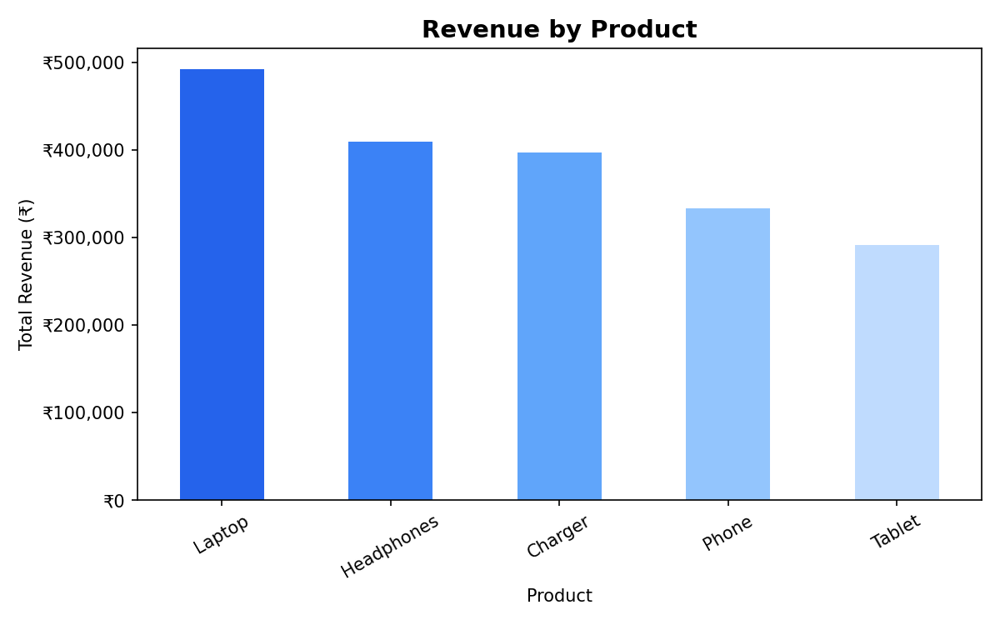
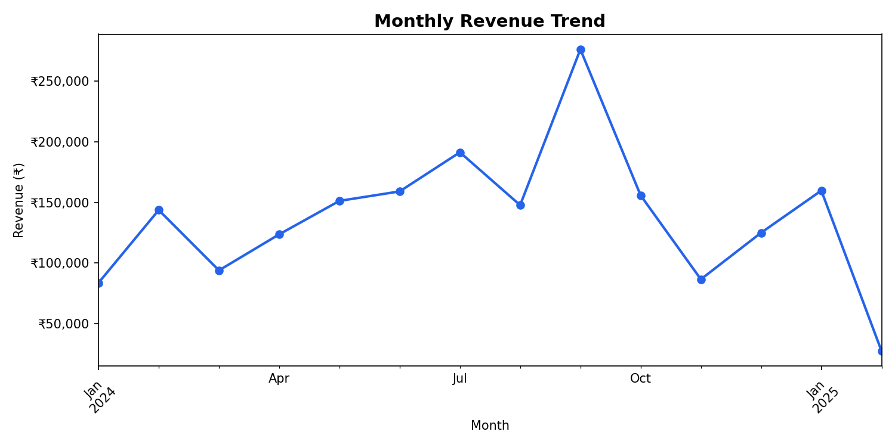

# Sales Data Analysis

A complete sales data analysis project using Python (Pandas, Matplotlib) and Excel.

## Project Overview
Analyzed 200+ sales records to uncover revenue trends, top-performing products,
and regional performance insights.

## Key Findings
- **Laptops** generated the highest revenue across all regions
- Revenue peaked in **March and June** 2024
- **North region** contributed ~30% of total sales

## Tech Stack
- Python: Pandas, Matplotlib
- Excel: Pivot Tables, VLOOKUP, Charts
- Jupyter Notebook

## Project Structure
sales-data-analysis/
├── data/           → raw and cleaned datasets
├── notebooks/      → Jupyter analysis notebook
├── visuals/        → exported charts
├── dashboard/      → Excel dashboard
└── requirements.txt

## How to Run
```bash
pip install -r requirements.txt
jupyter notebook notebooks/sales_analysis.ipynb
```

## Visualizations

